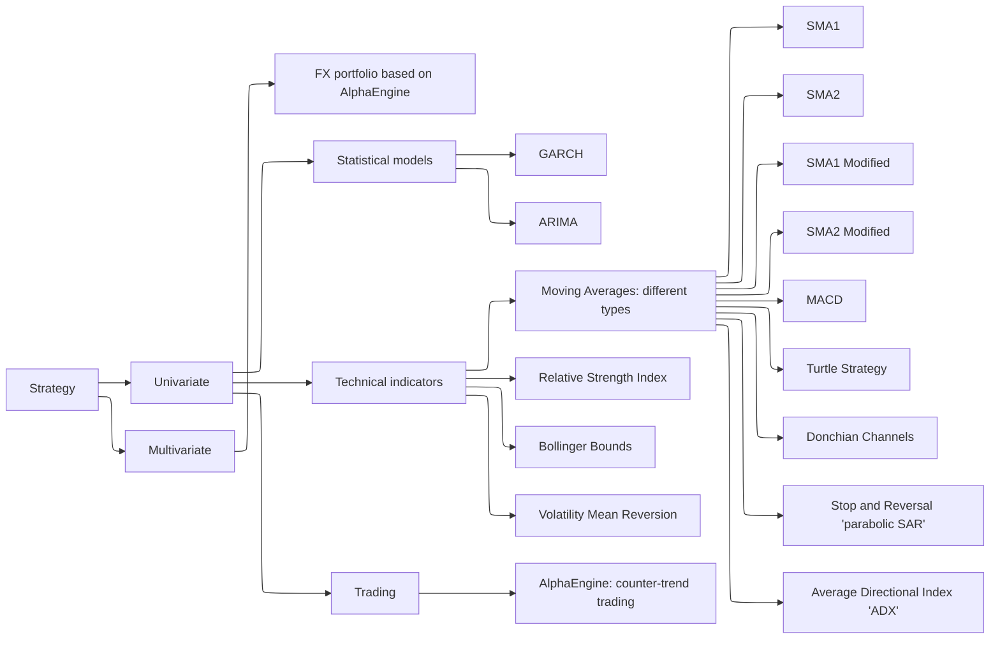

## Motivation  

Here, I test different trading ideas based on certain rules (called 'Active' strategy) and compare them with the strategy of simply buying and holding an asset ('Passive' strategy).  

The goal is to develop a superior, robust (asset-diverse, multimarket, multiperiod) price-based system. The trading profile of a strategy is estimated using different metrics to measure return and risk.  

All strategies are built using the R6 class system, which provides a modular and flexible framework for adding new strategies or features. This framework is deployed to the Shiny web server: [http://kraif999.shinyapps.io/backtesting_trading_strategies_shinyapp](http://kraif999.shinyapps.io/backtesting_trading_strategies_shinyapp).  

Choose an instrument, a strategy, a trading horizon, specify the strategy specific parameters and see how the strategy's trading profile, portfolio equity curves, and the list of all trades would look if you had consistently and strictly invested using that strategy signals with no emotions involved. 
The algorithm executes the strategy and calculates the number of positions, PnL, and equity curves based on the daily positions.
If risk management rules are applied, stop loss and take profit levels are calculated, and positions are automatically adjusted when these events occur. There is an option to either stay flat until a new signal is generated or re-enter the position after a stop-loss or take-profit event. Also, there is an option to dynamically shift stop loss in a case of a favourable price move given the position.
Additionally, other useful metrics are computed, for example, annualized volatility, average true range, and many more, see in *backtesting_trading_strategies/strategies.R.*

There is no such strategy combination that always guarantees highly superior returns under all market conditions, therefore, for a particular strategy the robustness conclusion could be based on how a strategy's trading profile looks on average given a different sets of strategy's combinations and chosen risk management rules.

---

## Design  

The framework is built in R, with apply_risk_management() and estimate_trading_profile() optimized using C++ (apply_risk_management_cpp() and estimate_trading_profile_cpp()). These C++ implementations improve execution speed by ~33 times in run_backtest() calls.

The high-level structure is as follows:  

- A parent class, **DataFetcher**, has methods to retrieve data from Yahoo (using overlapping daily data).  
- The **TSA** class analyzes data from various perspectives to understand different data characteristics and patterns.  
- A parent class for all strategies, **Strategy**, includes a generic signal generation method (overridden by specific strategies) and estimates the trading profile for both in-sample and out-of-sample data. It can also split in-sample or out-of-sample data further to evaluate the performance under different market regimes. 
- Child classes of the **Strategy** class represent different trading strategies, based on:
  - Technical Indicators (trend-following, mean-reverting, breakouts, etc.) 
  - Statistical approaches (GARCH, ARIMA)  
  - Other approaches (AlphaEngine: coastline counter-trend trading)  

Any market instrument available through a Yahoo ticker can be tested. Here, I explore several across different asset classes *FX*, *Equities*, *Commodities*, *Cryptocurrencies*, and *Fixed Income* to find potential strategy candidates for specific instruments.

The taxonomy of the trading strategies implemented is as follows:  

Below is the structure of classes (example with GARCH).

```mermaid
classDiagram

   class DataFetcher {
        + symbol
        + from_date
        + to_date
        + type
        + initialize(symbol, from_date, to_date, type): initializes the DataFetcher object.
        + convert_xts_to_wide_df(): fetches data for multiple symbols and saves tibble data frame in wide format.
        + download_xts_data(): downloads xts data and computes log returns.
        + plot_close_or_rets(type): visualizes Close price or returns.
        + compute_NA_close_price_ratio(): computes missing ratio of values that are not available for Close price.
    }
    class Strategy {
        + data
        + initialize(data) : initializes the Strategy object with provided data.
        + generate_signals() : generates trading signals, specific to each subclass (overriden by child class).
        + convert_to_tibble(ts) : converts time series data to a tibble format.
        + estimate_performance(symbol, capital, leverage, data_type, split_data, cut_date, window, apply_rm, flat_after_event, dynamic_limits, max_risk, reward_ratio)  : estimates performance for Active and Passive strategies.
        + get_trades(apply_rm) : provides the list of all trades with their performance.
        + plot_equity_lines(strategy_name, signal_flag = FALSE, symbol, capital) : visualizes equity lines for active strategy and passive (buy and hold).
        + estimate_range_potential(n) : estimates Average True Range based on the latest ndays.
        + plot_close_vs_vol(ndays) : plots Close price and range potential (true range / average true range).
        + plot_rm_levels(ndays, apply_rm) : plots Close price and stop loss and take profit levels for the last ndays.
        + plot_nop_evo() : displays the evolution of the number of positions and account size for Active strategy.
        - apply_risk_management(data, max_risk, reward_ratio, leverage, capital, flat_after_event, dynamic_limits) : applies a stop loss and reward take based on the thresholds (there is an option to shift limits when price changes in a favourable direction given position).
        - compute_metrics(data_subset, symbol) : computes return and risk related metrics for Active and Passive strategies.
        - estimate_trading_profile(data_subset, strategy_type) : estimates strategy's trading profile (risk and return are described by 25 metrics)
        - slicer(data, cut_date, data_type) : cuts the data into smaller equal periods.
    }

    class TSA {
        original_data: any = NULL
        data: any = NULL
        + initialize(data)
        + estimate_stationarity(freq = "daily", plot_flag = TRUE)
        + estimate_autocorr_rets_vol(test, freq = "daily", plot_flag = TRUE)
        + estimate_seasonality(freq = "daily")
        + estimate_heteroscedasticity(freq = "daily", plot_flag = TRUE)
        + estimate_arch_effects(freq = "daily", p = 1, q = 1, plot_flag = TRUE)
        + estimate_outliers(test, freq = "daily", plot_flag = TRUE, q1 = NULL, q3 = NULL, threshold = 1.5)
        + compute_wkd_rets(freq = "daily")
        + compute_summary_statistics(freq = "daily")
        - preprosess_data()
    }

    class GARCH {
        + specification
        + n_start
        + refit_every
        + refit_window
        + distribution_model
        + realized_vol
        + cluster
        + initialize(data, specification, n_start, refit_every, refit_window, distribution_model, realized_vol, cluster) : Initializes the GARCH object.
        + generate_signals() : specifies signal criteria based on GARCH model volatility forecasts.
        + run_backtest(symbols, specifications, n_starts, refits_every, refit_windows, distribution_models, realized_vols, output_df) : runs a backtest for GARCH-based strategy.
        - estimate_realized_volatility(data) : estimates realized volatility by different approaches.
        - set_signal_criteria(volData) : helper function for signal generation.
    }

    Strategy --|> GARCH
    
```

Below is an illustration of Bitcoin's trading profile based on the *SMA strategy, in particular, Simple Moving Average (SMA) 116-day window*. 
In this example the risk management is implemented by setting a stop loss to ensure that no more than 1/10th of the invested capital is lost at each trading day, with a reward-to-risk ratio of 3 (profit take limit). If stop loss or profit take event happens, the position is re-entered given the current signal. No leverage is applied. A strategy is checked on *in_sample data* (multimarket and multiperiod), then if results are promising and robust (at least in 60-70% cases active strategy is superior than the passive one), check it on *out_of_sample* data.

**The dynamics of invested capital:**  

Since the start of the investment, the active strategy's portfolio value remained higher than the passive strategy's, currently holding it's lead. Notably, the active strategy has exhibited a lower maximum drawdown compared to the passive strategy.

**Strategy trading profile:**  

| Metric                                   | In-Sample Active | In-Sample Passive | Out-of-Sample Active | Out-of-Sample Passive | Units |
|------------------------------------------|------------------|-------------------|----------------------|-----------------------|-------|
| ticker                                   | BTC-USD          | BTC-USD           | BTC-USD              | BTC-USD               |       |
| from                                     | 2018-04-28       | 2018-04-28        | 2024-10-25           | 2024-10-25            | Date  |
| to                                       | 2024-06-30       | 2024-06-30        | 2025-02-27           | 2025-02-27            | Date  |
| data_type                                | in_sample        | in_sample         | out_of_sample        | out_of_sample         |       |
| leverage                                 | 1                | 1                 | 1                    | 1                     |       |
| max_risk                                 | 0.1              | 0.1               | 0.1                  | 0.1                   |       |
| reward_ratio                             | 3                | 3                 | 3                    | 3                     |       |
| capital                                  | 1000             | 1000              | 1000                 | 1000                  | USD   |
| Strategy                                 | Active           | Passive           | Active               | Passive               |       |
| Gross Profit                             | 14918            | 6832              | 236                  | 257                   | USD   |
| Annualized Profit                        | 36.24            | 25.86             | 53.19                | 58.65                 | %     |
| Expected Absolute Return (per 1 trade)                 | 3.27             | NotApplicable     | 1                    | NotApplicable         | USD   |
| Largest Win                              | 1461             | 866               | 123                  | 117                   | USD   |
| Max Run-Up                               | 2398             | 2509              | 54                   | 59                    | %     |
| Average Win                              | 134.51           | 73.21             | 25.81                | 27.55                 | USD   |
| Length of Average Win                    | 13               | 14                | 28                   | 39                    | days  |
| Max Drawdown                             | -49              | -77               | -20                  | -21                   | %     |
| Largest Loss                             | -1372            | -887              | -88                  | -91                   | USD   |
| Average Loss                             | -127.96          | -70.53            | -22.31               | -23.85                | USD   |
| Length of Average Loss                   | 15               | 15                | 18                   | 19                    | days  |
| Number of Trades Per Year                | 15               | 0                 | 3                    | 0                     |       |
| Percentage of Winning Trades             | 50               | NotApplicable     | 28.57                | NotApplicable         | %     |

The active strategy performs better in-sample in terms of return and risk, its performance declines slightly in the out-of-sample period. 
The framework allows users to select different assets, periods (including custom splits for further periods), strategies, parameters, risk management applications, and leverage, providing a comprehensive strategy profile view as if it had been consistently applied. For instance, once the strategy is deployed, you may not be aware of the current winning or losing streak, but knowing this could give you valuable insights into the strategy’s performance.

**Backtesting results:**

Below is an illustration of backtesting results.
The engine is run for BTC-USD using different sets of SMA1 strategy combinations and risk management parameters (including leverage).
In-sample data is used in order to identify good candidates, and check their performance on the out-of-sample data.
Here SMA1 with 116 days could be considered as such.
The engine is flexible, and the same approach can be applied to any strategy and asset from the list provided above.

### Parameters Used in the Backtest:
- **Symbols**: BTC-USD  
- **Window Sizes**: 10, 12, 16, 20, 24, 31, 38, 48, 60, 75, 93, 116, 146, 182  
- **Moving Average Types**: SMA, EMA  
- **Data Type**: in_sample  
- **Split**: FALSE (whether the data is split into sub-periods for a more granular view under different market regimes)  
- **Cut Date**: 2024-01-01  
- **From Date**: 2018-01-01  
- **To Date**: 2025-02-16  
- **Slicing Years**: 1 (if split is TRUE, defines the slicing granularity)  
- **Risk Management**: Applied  
- **Flat After Event**: TRUE, FALSE (stay flat after a stop loss or profit take event until a new signal emerges OR re-enter the position)  
- **Max Risks**: 0.1, 0.2, 0.3  
- **Reward Ratios**: 2, 3  
- **Leverages**: 1, 2  

