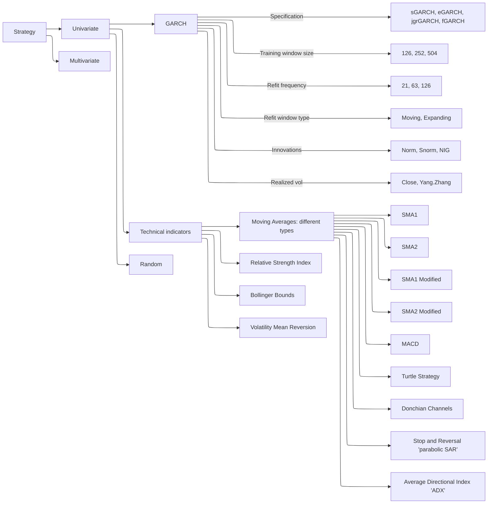
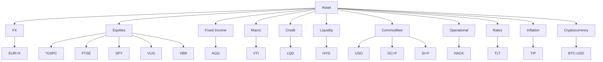

This branch encompasses forecasting experiments involving trading strategies rooted in different technical indicators and GARCH model specifications, executed across various training sample sizes and innovation distributions. The performance evaluation of these strategies, termed "Active," is compared against a benchmark buy-and-hold strategy, termed "Passive." The utilized dataset comprises univariate time series overlapping daily data.

All strategies are architected using the R6 class, enabling flexible incorporation of new strategies. The overarching design comprises:

- A parent class, **DataFetcher**, which features methods for data retrieval from Yahoo.
- A parent class, **Strategy**, housing a generic 'signal generation' method, subsequently overridden by child classes, thereby tailoring the signal generation engine to specific strategy implementations.
- The child classes of the Strategy class represent specific trading strategies (*SMA1*, *SMA1M*, *SMA2*, *SMA2M*, *BollingerBreakout*, *VolatilityMeanReversion*, *RSI*, *Random*)
- Following the signal generation phase, subsequent steps involve the provision of performance metrics and equity lines (**Strategy** class methods).
The taxonomical hierarchy of trading strategies is as follows:

The taxonomy of assets which represent 11 unique asset classes and used in trading strategies is as follows:

