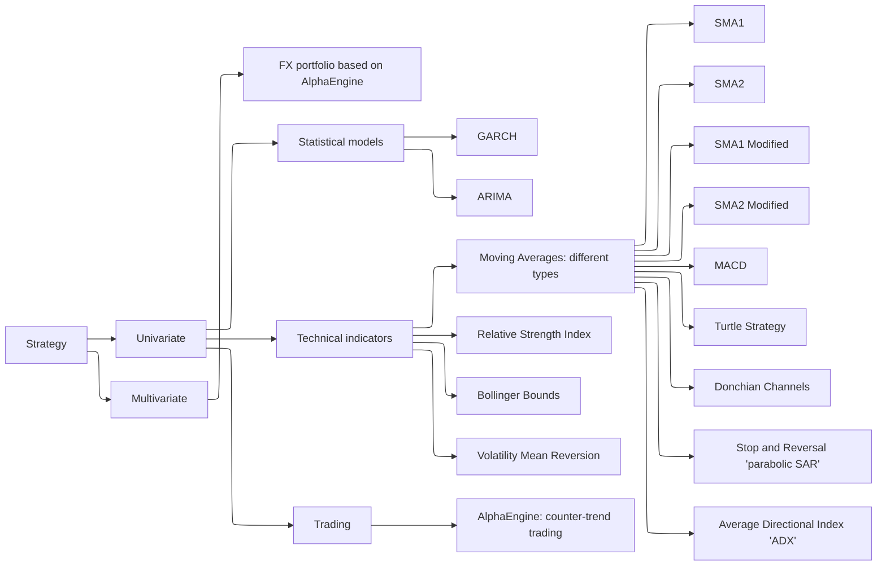
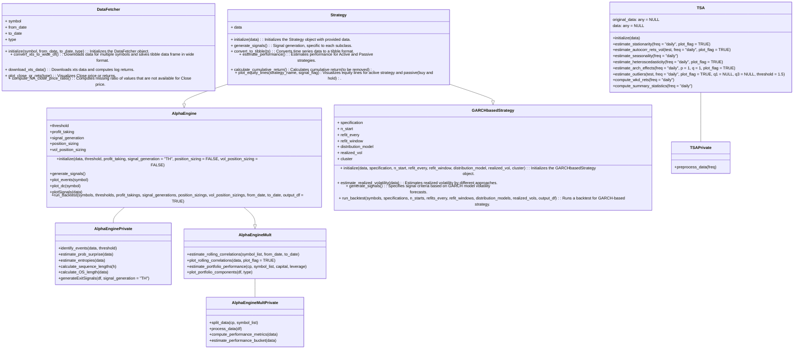

This branch contains experiments involving the implementation of a wide range of trading strategies across various asset classes. 
The performance of these strategies, referred to as 'Active,' is compared against a benchmark buy-and-hold strategy, referred to as 'Passive'.
Additionally, there is TSA class which analyses time series patterns and various characteristics.
Also,the estimation of a strategy's trading profile has been introduced (see the example in *estimate_trading_profile.R*). 
Its purpose is to assess the overall risk profile of a strategy (macroscopic level) and provide a detailed list of trades (microscopic level) across multiple markets and time periods (including the choice of in-sample or out-of-sample data split) under varying market conditions. Furthermore, the framework supports the application of stop-loss and profit-taking mechanisms, enabling users to manage risk and lock in profits.

All strategies are architected using the R6 class system, which provides a modular and flexible framework for incorporating new features or strategies.

Also, the approach is deployed to Shiny web server: http://kraif999.shinyapps.io/backtesting_trading_strategies

Using Yahoo tickers any strategy (currently except ARIMA and AlphaEngine) could be applied: the outputs include a strategy's trading profile, equity curves, and the list of all trades.

The design is structured as follows::

- A parent class, **DataFetcher**, which features methods for overlapping daily data retrieval from Yahoo.
- A parent class, **Strategy**, contains a generic 'signal generation' method, subsequently overridden by child classes, thereby tailoring the signal generation engine to specific strategy implementations.
- The child classes of the Strategy class represent specific trading strategies (based on *Technical  Indicators*, statistical models (*GARCH*, *ARIMA*), or other approaches (*AlphaEngine: coastline counter-trend trading*).
- Following the signal generation phase, next steps involve the provision of performance metrics and equity lines (**Strategy** class methods).
Assets used represent the following classes: *FX*, *Equities*, *Commodities*, *Cryptocurrencies*, *Fixed Income*, *Macro*.

Across different strategies around **~37,000** parameters combinations were tested, refer to **'Run_backtest_results'** folder.

The taxonomy of trading strategies implemented is as follows:

See below example of classes design.

Below is an example of Bitcoin's trading profile based on the **SMA strategy** with a Hull Moving Average (100-day window).
Stop-loss and take-profit limits are set at 1.5% and 37.5% of the Close price throughout the entire trading period.

**Performance visualization:**  

**Trading Profile:**  

The estimated *in_sample and out_of_sample* trading profile is as follows:

| Metric                          | V1 (in-sample) | V2 (in-sample) | V3 (in-sample) | V4 (in-sample) | V1 (out-sample) | V2 (out-sample) | Units |
|---------------------------------|----------------|----------------|----------------|----------------|-----------------|-----------------|--------------------|
| ticker                          | BTC-USD        | BTC-USD        | BTC-USD        | BTC-USD        | BTC-USD         | BTC-USD         |                    |
| from                            | 2018-04-21     | 2018-04-21     | 2022-04-21     | 2022-04-21     | 2024-04-20      | 2024-04-20      |                    |
| to                              | 2022-04-20     | 2022-04-20     | 2024-01-01     | 2024-01-01     | 2025-01-15      | 2025-01-15      |                    |
| data_type                       | in_sample      | in_sample      | in_sample      | in_sample      | out_of_sample   | out_of_sample   |                    |
| Strategy                        | Active         | Passive        | Active         | Passive        | Active          | Passive         |                    |
| GrossProfit                     | 1610           | 4375           | 1030           | 490            | -104            | 531             | USD                |
| AnnualizedProfit                | 18.00          | 33.68          | 14.87          | 2.81           | -9.75           | 48.78           | %                  |
| NumberOfTradesPerYear           | 38             | 0              | 16             | 0              | 16              | 0               |                    |
| PercentageOfWinningTrades      | 43.23          | NotApplicable  | 48.98          | NotApplicable  | 41.94           | NotApplicable   | %                  |
| AverageWin                      | 588            | 559            | 543            | 501            | 1414            | 1445            | USD                |
| LengthOfAverageWin              | 9              | 8              | 16             | 12             | 12              | 10              | days               |
| LargestWin                      | 7554           | 7293           | 3762           | 3092           | 8227            | 8227            | USD                |
| LengthOfLargestWin              | 13             | 1              | 40             | 57             | 34              | 34              | days               |
| AverageLoss                     | -547           | -571           | -461           | -451           | -1376           | -1248           | USD                |
| LengthOfAverageLoss             | 7              | 7              | 10             | 13             | 7               | 7               | days               |
| LargestLoss                     | -5822          | -7554          | -2536          | -4275          | -6683           | -6099           | USD                |
| LengthOfLargestLoss             | 6              | 13             | 10             | 22             | 6               | 3               | days               |
| AverageWinningRun               | 1.85           | 1.94           | 1.86           | 1.83           | 1.91            | 2.00            | USD                |
| LengthOfTimeInAverageWinningRun | 2              | 2              | 2              | 2              | 2               | 2               | days               |
| LargestWinningRun               | 8              | 10             | 7              | 9              | 5               | 7               | days               |
| LengthOfTimeInLargestWinningRun | 8              | 10             | 7              | 9              | 5               | 7               | days               |
| AverageLosingRun                | 2              | 1              | 1              | 1              | 1               | 1               | USD                |
| LengthOfTimeInAverageLosingRun  | 5              | 2              | 4              | 2              | 4               | 2               | days               |
| LargestLosingRun                | 46             | 10             | 56             | 9              | 23              | 7               | days               |
| LengthOfTimeInLargestLosingRun  | 46             | 10             | 56             | 9              | 23              | 7               | days               |
| MaxDrawdown                     | -37.33         | -67.40         | -26.19         | -61.41         | -24.97          | -24.84          | %                  |
| LengthOfMaxDrawdown             | 145            | 224            | 250            | 202            | 98              | 77              | days               |
| StartDateMaxDrawdown            | 2021-10-20     | 2018-05-05     | 2022-07-08     | 2022-04-21     | 2024-07-07      | 2024-05-20      | Date               |
| EndDateMaxDrawdown              | 2022-03-14     | 2018-12-15     | 2023-03-15     | 2022-11-09     | 2024-10-13      | 2024-08-05      | Date               |
| MaxRunUp                        | 427.55         | 2318.52        | 73.15          | 183.23         | 24.71           | 97.20           | %                  |
| LengthOfMaxRunUp                | 1072           | 1059           | 268            | 418            | 56              | 134             | days               |
| StartDateMaxRunUp               | 2018-11-13     | 2018-12-15     | 2023-03-15     | 2022-11-09     | 2024-10-13      | 2024-08-05      | Date               |
| EndDateMaxRunUp                 | 2021-10-20     | 2021-11-08     | 2023-12-08     | 2024-01-01     | 2024-12-08      | 2024-12-17      | Date               |