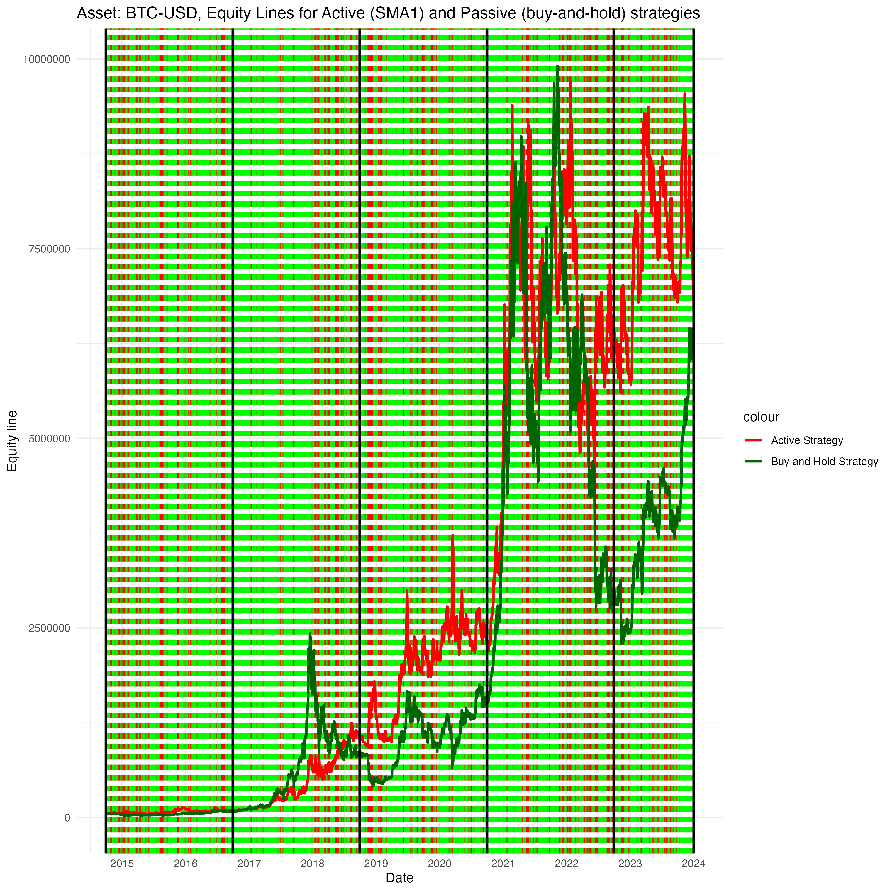
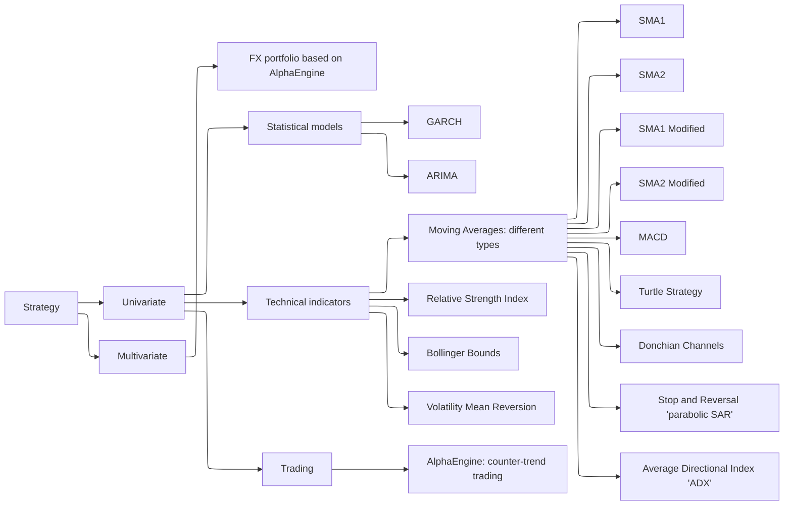

This branch contains experiments involving the implementation of a wide range of trading strategies across various asset classes. 
The performance of these strategies, referred to as 'Active,' is compared against a benchmark buy-and-hold strategy, referred to as 'Passive'.
Additionally, there is TSA class which analyses time series patterns and various characteristics.

All strategies are architected using the R6 class system, which provides a modular and flexible framework for incorporating new features or strategies.

The design is structured as follows::

- A parent class, **DataFetcher**, which features methods for overlapping daily data retrieval from Yahoo.
- A parent class, **Strategy**, contains a generic 'signal generation' method, subsequently overridden by child classes, thereby tailoring the signal generation engine to specific strategy implementations.
- The child classes of the Strategy class represent specific trading strategies (based on *Technical  Indicators*, statistical models (*GARCH*, *ARIMA*), or other approaches (*AlphaEngine: coastline counter-trend trading*).
- Following the signal generation phase, next steps involve the provision of performance metrics and equity lines (**Strategy** class methods).
Assets used represent the following classes: *FX*, *Equities*, *Commodities*, *Cryptocurrencies*, *Fixed Income*, *Macro*.

Around **~37,000** parameters combinations were tested, refer to **'Run_backtest_results'** folder.

Additionally, the estimation of a strategy's trading profile has been introduced (see the example in estimate_trading_profile.R). 
Its purpose is to assess the overall risk profile of a strategy (macroscopic level) and provide a detailed list of trades (microscopic level) across multiple markets and time periods (including the choice of in-sample or out-of-sample data split) under varying market conditions.


Performance for Bitcoin. The black vertical lines represent periods split; metrics are computed for each such period.

The taxonomy of trading strategies implemented is as follows:



See below example of classes design.

```mermaid
classDiagram

   class DataFetcher {
        + symbol
        + from_date
        + to_date
        + type
        + initialize(symbol, from_date, to_date, type): Initializes the DataFetcher object.
        + convert_xts_to_wide_df(): Downloads data for multiple symbols and saves tibble data frame in wide format.
        + download_xts_data(): Downloads xts data and computes log returns.
        + plot_close_or_rets(type): Visualizes Close price or returns.
        + compute_NA_close_price_ratio(): Computes missing ratio of values that are not available for Close price.
    }
    class Strategy {
        + data
        + initialize(data) : Initializes the Strategy object with provided data.
        + generate_signals() : Signal generation, specific to each subclass.
        + convert_to_tibble(ts) : Converts time series data to a tibble format.
        + estimate_performance() : Estimates performance for Active and Passive strategies.
        + calculate_cumulative_return() : Calculates cumulative return (to be removed).
        + plot_equity_lines(strategy_name, signal_flag) : Visualizes equity lines for active strategy and passive (buy and hold).
    }

    class AlphaEngine {
        +threshold
        +profit_taking
        +signal_generation
        +position_sizing
        +vol_position_sizing
        +initialize(data, threshold, profit_taking, signal_generation = "TH", position_sizing = FALSE, vol_position_sizing = FALSE)
        +generate_signals()
        +plot_events(symbol)
        +plot_dc(symbol)
        +plotSignals(data)
        +run_backtest(symbols, thresholds, profit_takings, signal_generations, position_sizings, vol_position_sizings, from_date, to_date, output_df = TRUE)
    }
    class AlphaEnginePrivate {
        +identify_events(data, threshold)
        +estimate_prob_surprise(data)
        +estimate_entropies(data)
        +calculate_sequence_lengths(h)
        +calculate_OS_length(data)
        +generateExitSignals(df, signal_generation = "TH")
    }
    AlphaEngine -- AlphaEnginePrivate

    class AlphaEngineMult {
        +estimate_rolling_correlations(symbol_list, from_date, to_date)
        +plot_rolling_correlations(data, plot_flag = TRUE)
        +estimate_portfolio_performance(cp, symbol_list, capital, leverage)
        +plot_portfolio_components(df, type)
    }
    class AlphaEngineMultPrivate {
        +split_data(cp, symbol_list)
        +process_data(df)
        +compute_performance_metrics(data)
        +estimate_performance_bucket(data)
    }
    AlphaEngineMult -- AlphaEngineMultPrivate

    class TSA {
        original_data: any = NULL
        data: any = NULL
        +initialize(data)
        +estimate_stationarity(freq = "daily", plot_flag = TRUE)
        +estimate_autocorr_rets_vol(test, freq = "daily", plot_flag = TRUE)
        +estimate_seasonality(freq = "daily")
        +estimate_heteroscedasticity(freq = "daily", plot_flag = TRUE)
        +estimate_arch_effects(freq = "daily", p = 1, q = 1, plot_flag = TRUE)
        +estimate_outliers(test, freq = "daily", plot_flag = TRUE, q1 = NULL, q3 = NULL, threshold = 1.5)
        +compute_wkd_rets(freq = "daily")
        +compute_summary_statistics(freq = "daily")
    }
    class TSAPrivate {
        +preprocess_data(freq)
    }
    TSA -- TSAPrivate

    class GARCHbasedStrategy {
        + specification
        + n_start
        + refit_every
        + refit_window
        + distribution_model
        + realized_vol
        + cluster
        + initialize(data, specification, n_start, refit_every, refit_window, distribution_model, realized_vol, cluster) : Initializes the GARCHbasedStrategy object.
        + estimate_realized_volatility(data) : Estimates realized volatility by different approaches.
        + generate_signals() : Specifies signal criteria based on GARCH model volatility forecasts.
        + run_backtest(symbols, specifications, n_starts, refits_every, refit_windows, distribution_models, realized_vols, output_df) : Runs a backtest for GARCH-based strategy.
    }


    Strategy --|> AlphaEngine
    Strategy --|> GARCHbasedStrategy
    AlphaEngine --|> AlphaEngineMult
