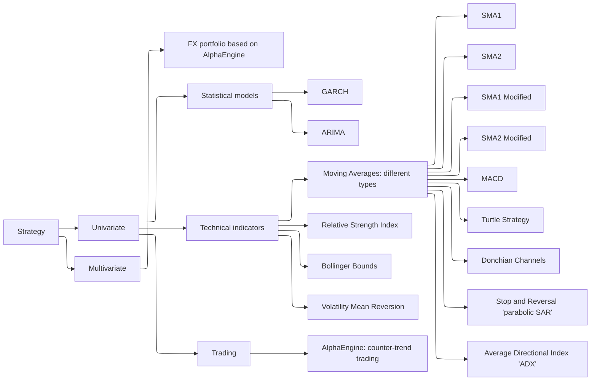
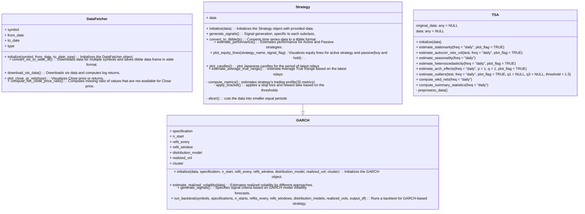

## Motivation  

Here, I test different trading ideas based on certain rules (called 'Active' strategy) and compare them with the strategy of simply buying and holding an asset ('Passive' strategy).  

The goal is to develop and find a superior, robust (multimarket and multiperiod) price-based system. The trading profile of a strategy is estimated using different metrics to measure return and risk.  

All strategies are built using the R6 class system, which provides a modular and flexible framework for adding new strategies or features. This framework is deployed to the Shiny web server: [http://kraif999.shinyapps.io/backtesting_trading_strategies](http://kraif999.shinyapps.io/backtesting_trading_strategies).  

Choose an instrument, a strategy, and a trading horizon, and see how the strategy's trading profile, portfolio equity curves, and the list of all trades would look if you had consistently and strictly invested using that strategy signals with no emotions involved. 

There is no such strategy combination that always guarantees highly superior returns under all market conditions, therefore, for a particular strategy the robustness conclusion could be based on how a strategy's trading profile looks on average given a different sets of strategy's combinations.

---

## Design  

The process is to first check a strategy on *in_sample data* (multimarket and multiperiod), then if results are promising, check it on *out_of_sample* data.

The high-level structure looks like this:  

- A parent class, **DataFetcher**, has methods to retrieve data from Yahoo (using overlapping daily data).  
- The **TSA** class analyzes data from various perspectives to understand different characteristics.  
- A parent class for all strategies, **Strategy**, includes a generic signal generation method (overridden by specific strategies) and estimates the trading profile for both in-sample and out-of-sample data. It can also split in-sample or out-of-sample data further to evaluate the performance under different market regimes. 
- Child classes of the **Strategy** class represent different trading strategies, based on:
  - Technical Indicators (trend-following, mean-reverting, breakouts, etc.) 
  - Statistical approaches (GARCH, ARIMA)  
  - Other approaches (AlphaEngine: coastline counter-trend trading)  

Any market instrument can be used (via Yahoo ticker). Here, I test a few across various asset classes, including *FX*, *Equities*, *Commodities*, *Cryptocurrencies*, and *Fixed Income*. There are around ~37,000 combinations tested to identify what could be a good strategy for a particular instrument.

The taxonomy of the trading strategies implemented is as follows:  

See below example of classes design in R.

Below is an illustration of Bitcoin's trading profile based on the *SMA strategy, in particular, Exponential Moving Average (EMA) 20-day window)*. Risk management is implemented by setting a stop loss to ensure that no more than 1/10th of the invested capital is lost, with a reward-to-risk ratio of 3. No leverage is applied.

**The dynamics of invested capital:**  

The portfolio value of the active strategy surpassed that of the passive strategy at the end of 2019 and continued to outperform until 2024. However, beginning in 2024, the passive strategy has shown dominance. Notably, the active strategy has exhibited a lower maximum drawdown compared to the passive strategy.

**Strategy trading profile:**  

| Metric                          | V1 (in-sample) | V2 (in-sample) | V1 (out-sample) | V2 (out-sample) | Units |
|---------------------------------|----------------|----------------|-----------------|-----------------|--------------------|
| ticker                          | BTC-USD        | BTC-USD        | BTC-USD         | BTC-USD         |                    |
| from                            | 2021-01-22     | 2021-01-22     | 2024-01-22      | 2024-01-22      |                    |
| to                              | 2024-01-01     | 2024-01-01     | 2025-02-10      | 2025-02-10      |                    |
| data_type                       | in_sample      | in_sample      | out_of_sample   | out_of_sample   |                    |
| leverage                        | 1              | 1              | 1               | 1               |                    |
| max_risk                        | 0.1            | 0.1            | 0.1             | 0.1             |                    |
| reward_ratio                    | 3              | 3              | 3               | 3               |                    |
| capital                         | 1000           | 1000           | 1000            | 1000            | USD                |
| Strategy                        | Active         | Passive        | Active          | Passive         |                    |
| GrossProfit                     | 488            | 394            | 109             | 1498            | USD                |
| AnnualizedProfit                | 9.78           | 8.10           | 7.04            | 82.07           | %                  |
| NumberOfTradesPerYear           | 32             | 0              | 26              | 0               |                    |
| PercentageOfWinningTrades       | 42.19          | NotApplicable  | 44.23           | NotApplicable   | %                  |
| AverageWin                      | 32             | 27             | 23              | 38              | USD                |
| LengthOfAverageWin              | 10             | 9              | 8               | 8               | days               |
| LargestWin                      | 256            | 223            | 128             | 201             | USD                |
| LengthOfLargestWin              | 8              | 12             | 16              | 16              | days               |
| AverageLoss                     | -31            | -25            | -22             | -33             | USD                |
| LengthOfAverageLoss             | 6              | 8              | 7               | 7               | days               |
| LargestLoss                     | -277           | -229           | -136            | -156            | USD                |
| LengthOfLargestLoss             | 11             | 1              | 6               | 27              | days               |
| AverageWinningRun               | 1.97           | 1.84           | 1.99            | 2.04            | USD                |
| LengthOfTimeInAverageWinningRun | 2              | 2              | 2               | 2               | days               |
| LargestWinningRun               | 10             | 10             | 6               | 8               | days               |
| LengthOfTimeInLargestWinningRun | 10             | 10             | 6               | 8               | days               |
| AverageLosingRun                | 2              | 1              | 1               | 1               | USD                |
| LengthOfTimeInAverageLosingRun  | 3              | 2              | 3               | 2               | days               |
| LargestLosingRun                | 29             | 10             | 36              | 8               | days               |
| LengthOfTimeInLargestLosingRun  | 29             | 10             | 36              | 8               | days               |
| MaxDrawdown                     | -56.59         | -77.05         | -31.95          | -25.37          | %                  |
| LengthOfMaxDrawdown             | 147            | 366            | 49              | 145             | days               |
| StartDateMaxDrawdown            | 2022-06-16     | 2021-11-08     | 2024-03-21      | 2024-03-13      | Date               |
| EndDateMaxDrawdown              | 2022-11-10     | 2022-11-09     | 2024-05-09      | 2024-08-05      | Date               |
| MaxRunUp                        | 199.54         | 183.23         | 63.30           | 172.19          | %                  |
| LengthOfMaxRunUp                | 497            | 418            | 321             | 330             | days               |
| StartDateMaxRunUp               | 2021-02-04     | 2022-11-09     | 2024-02-06      | 2024-01-22      | Date               |
| EndDateMaxRunUp                 | 2022-06-16     | 2024-01-01     | 2024-12-23      | 2024-12-17      | Date               |

While the active strategy performs better in-sample in terms of return and risk, its performance declines in the out-of-sample period. 
The framework allows users to select different assets, periods (including custom splits for further periods), strategies, parameters, risk management applications, and leverage, providing a comprehensive strategy profile view as if it had been consistently applied. For instance, once the strategy is deployed, you may not be aware of the current winning or losing streak, but knowing this could give you valuable insights into the strategy’s performance and overall dynamics.

