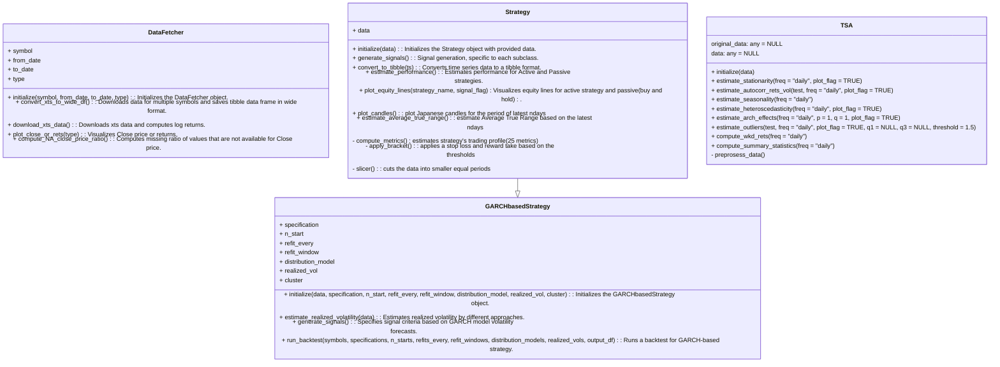

## Motivation  

Here, I test different trading ideas based on certain rules (called 'Active' strategy) and compare them with the strategy of simply buying and holding an asset ('Passive' strategy).  

The goal is to develop and find a superior, robust (multimarket and multiperiod) price-based system. The trading profile of a strategy is estimated using different metrics to measure return and risk.  

All strategies are built using the R6 class system, which provides a modular and flexible framework for adding new strategies or features. This framework is deployed to the Shiny web server: [http://kraif999.shinyapps.io/backtesting_trading_strategies](http://kraif999.shinyapps.io/backtesting_trading_strategies).  

Choose an instrument, a strategy, and a trading horizon, and see how the strategy's trading profile, portfolio equity curves, and the list of all trades would look if you had consistently invested using that strategy.  

There is no magical strategy combination that always guarantees highly superior returns under all market conditions (I hoped it would), therefore, the robustness conclusion is based on how a strategy's trading profile looks on average given a different set of strategy combinations.

---

## Design  

The process is to first check a strategy on *in_sample data* (multimarket and multiperiod), then if results are promising, check it on *out_of_sample* data.

The high-level structure looks like this:  

- A parent class, **DataFetcher**, has methods to retrieve data from Yahoo (using overlapping daily data).  
- The **TSA** class analyzes data from various perspectives to understand different characteristics.  
- A parent class for all strategies, **Strategy**, includes a generic signal generation method (overridden by specific strategies) and estimates the trading profile for both in-sample and out-of-sample data. It can also split in-sample data further to evaluate the performance under different market regimes. 
- Child classes of the **Strategy** class represent specific trading strategies, such as:  
  - Technical Indicators (moving averages, breakouts, etc.) 
  - Statistical models (GARCH, ARIMA)  
  - Other approaches (AlphaEngine: coastline counter-trend trading)  

Any market instrument can be used (via Yahoo ticker). Here, I test a few across various asset classes, including *FX*, *Equities*, *Commodities*, *Cryptocurrencies*, and *Fixed Income*. There are around ~37,000 combinations tested to identify what could be a good strategy for a particular instrument.

The taxonomy of the trading strategies implemented is as follows:  

See below example of classes design in R.

Below is an example of Bitcoin's trading profile based on the *SMA strategy, in particular Exponential Moving Average (EMA) 20-day window)*.
Stop-loss and take-profit limits are set at 1.5% and 37.5% of the close price throughout the entire trading period.

**Performance visualization:**  

**Trading Profile:**  

The estimated trading profile, based on an initial investment of 1000 USDC at the beginning of the period, is as follows for both the in-sample and out-of-sample periods:

| Metric                          | V1 (in-sample) | V2 (in-sample) | V3 (in-sample) | V4 (in-sample) | V1 (out-sample) | V2 (out-sample) | Units |
|---------------------------------|----------------|----------------|----------------|----------------|-----------------|-----------------|--------------------|
| ticker                          | BTC-USD        | BTC-USD        | BTC-USD        | BTC-USD        | BTC-USD         | BTC-USD         |                    |
| from                            | 2018-04-21     | 2018-04-21     | 2022-04-21     | 2022-04-21     | 2024-04-20      | 2024-04-20      |                    |
| to                              | 2022-04-20     | 2022-04-20     | 2024-01-01     | 2024-01-01     | 2025-01-15      | 2025-01-15      |                    |
| data_type                       | in_sample      | in_sample      | in_sample      | in_sample      | out_of_sample   | out_of_sample   |                    |
| Strategy                        | Active         | Passive        | Active         | Passive        | Active          | Passive         |                    |
| GrossProfit                     | 1610           | 4375           | 1030           | 490            | -104            | 531             | USD                |
| AnnualizedProfit                | 18.00          | 33.68          | 14.87          | 2.81           | -9.75           | 48.78           | %                  |
| NumberOfTradesPerYear           | 38             | 0              | 16             | 0              | 16              | 0               |                    |
| PercentageOfWinningTrades      | 43.23          | NotApplicable  | 48.98          | NotApplicable  | 41.94           | NotApplicable   | %                  |
| AverageWin                      | 588            | 559            | 543            | 501            | 1414            | 1445            | USD                |
| LengthOfAverageWin              | 9              | 8              | 16             | 12             | 12              | 10              | days               |
| LargestWin                      | 7554           | 7293           | 3762           | 3092           | 8227            | 8227            | USD                |
| LengthOfLargestWin              | 13             | 1              | 40             | 57             | 34              | 34              | days               |
| AverageLoss                     | -547           | -571           | -461           | -451           | -1376           | -1248           | USD                |
| LengthOfAverageLoss             | 7              | 7              | 10             | 13             | 7               | 7               | days               |
| LargestLoss                     | -5822          | -7554          | -2536          | -4275          | -6683           | -6099           | USD                |
| LengthOfLargestLoss             | 6              | 13             | 10             | 22             | 6               | 3               | days               |
| AverageWinningRun               | 1.85           | 1.94           | 1.86           | 1.83           | 1.91            | 2.00            | USD                |
| LengthOfTimeInAverageWinningRun | 2              | 2              | 2              | 2              | 2               | 2               | days               |
| LargestWinningRun               | 8              | 10             | 7              | 9              | 5               | 7               | days               |
| LengthOfTimeInLargestWinningRun | 8              | 10             | 7              | 9              | 5               | 7               | days               |
| AverageLosingRun                | 2              | 1              | 1              | 1              | 1               | 1               | USD                |
| LengthOfTimeInAverageLosingRun  | 5              | 2              | 4              | 2              | 4               | 2               | days               |
| LargestLosingRun                | 46             | 10             | 56             | 9              | 23              | 7               | days               |
| LengthOfTimeInLargestLosingRun  | 46             | 10             | 56             | 9              | 23              | 7               | days               |
| MaxDrawdown                     | -37.33         | -67.40         | -26.19         | -61.41         | -24.97          | -24.84          | %                  |
| LengthOfMaxDrawdown             | 145            | 224            | 250            | 202            | 98              | 77              | days               |
| StartDateMaxDrawdown            | 2021-10-20     | 2018-05-05     | 2022-07-08     | 2022-04-21     | 2024-07-07      | 2024-05-20      | Date               |
| EndDateMaxDrawdown              | 2022-03-14     | 2018-12-15     | 2023-03-15     | 2022-11-09     | 2024-10-13      | 2024-08-05      | Date               |
| MaxRunUp                        | 427.55         | 2318.52        | 73.15          | 183.23         | 24.71           | 97.20           | %                  |
| LengthOfMaxRunUp                | 1072           | 1059           | 268            | 418            | 56              | 134             | days               |
| StartDateMaxRunUp               | 2018-11-13     | 2018-12-15     | 2023-03-15     | 2022-11-09     | 2024-10-13      | 2024-08-05      | Date               |
| EndDateMaxRunUp                 | 2021-10-20     | 2021-11-08     | 2023-12-08     | 2024-01-01     | 2024-12-08      | 2024-12-17      | Date               |