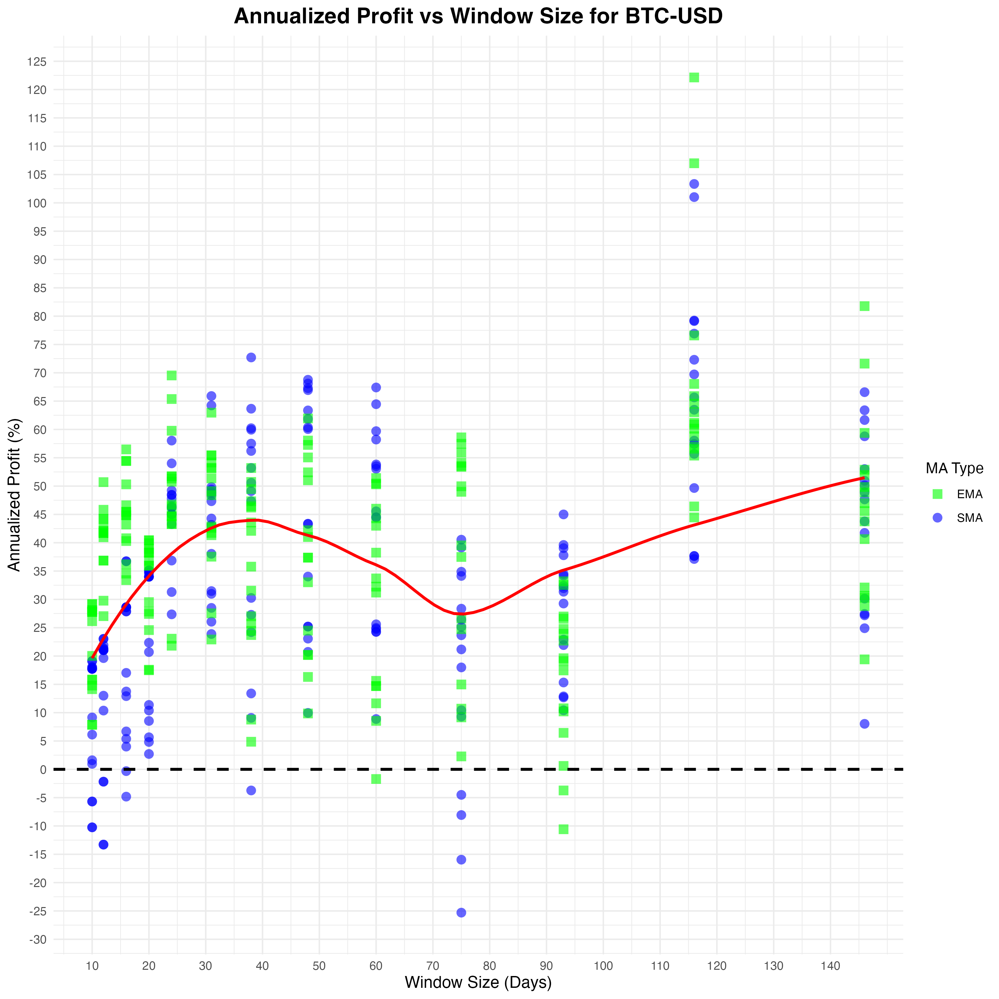

## Motivation  

Here, I test different trading ideas based on certain rules (called 'Active' strategy) and compare them with the strategy of simply buying and holding an asset ('Passive' strategy).  

The goal is to develop a superior, robust (asset-diverse, multimarket, multiperiod) price-based system. The trading profile of a strategy is estimated using different metrics to measure return and risk.  

There is no such strategy combination that always guarantees highly superior returns under all market conditions, therefore, for a particular strategy the robustness conclusion could be based on how a strategy's trading profile looks on average given a different sets of strategy's combinations (strategy's family) and chosen risk management rules.

## Design  

All strategies are built using the R6 class system, which provides a modular and flexible framework for adding new strategies or features. This framework is deployed to the Shiny web server: [http://kraif999.shinyapps.io/backtesting_trading_strategies_shinyapp](http://kraif999.shinyapps.io/backtesting_trading_strategies_shinyapp).  

Choose an instrument, a strategy, and a trading horizon. Specify the strategy-specific parameters along with risk and financial management parameters, and see how the strategy performs if you had consistently and strictly invested using its signals with no emotions involved.
Essentially the algorithm executes the strategy and calculates the number of positions, PnL, and equity curves, based on the daily positions.
If risk management rules are applied, stop loss and take profit levels are calculated, and positions are automatically adjusted when these events occur. There is an option to either stay flat until a new signal is generated or re-enter the position after a stop-loss or take-profit event. Also, there is an option to dynamically shift stop loss in a case of a favourable price move given the position.
Additionally, other useful metrics are computed, for example, annualized volatility, average true range, and many more, see in *backtesting_trading_strategies/strategies.R.*

The core methods: apply_risk_management() and estimate_trading_profile() are optimized using their C++ versions (apply_risk_management_cpp() and estimate_trading_profile_cpp(), correspondingly). These C++ implementations improve execution speed by ~33 times in run_backtest() calls. In total over a 500,000 trading profiles have been estimated across all strategies.

The high-level structure of the framework is as follows:  

- A parent class, **DataFetcher**, has methods to retrieve data from Yahoo (using overlapping daily data).  
- The **TSA** class analyzes data from various perspectives to understand different data characteristics and patterns.  
- A parent class for all strategies, **Strategy**, includes a generic signal generation method (overridden by specific strategies) and estimates the trading profile for both in-sample and out-of-sample data. It can also split in-sample or out-of-sample data further to evaluate the performance under different market regimes. 
- Child classes of the **Strategy** class represent different trading strategies, based on:
  - Technical Indicators (trend-following, mean-reverting, breakouts, etc.) 
  - Statistical approaches (GARCH, ARIMA)  
  - Other approaches (AlphaEngine: coastline counter-trend trading)  

Any market instrument available through a Yahoo ticker can be tested. Here, I explore several across different asset classes *FX*, *Equities*, *Commodities*, *Cryptocurrencies*, and *Fixed Income* to find potential strategy candidates for specific instruments.

The taxonomy of the trading strategies implemented is as follows:  

Below is the structure of classes (example with GARCH).

```mermaid
classDiagram

   class DataFetcher {
        + symbol
        + from_date
        + to_date
        + type
        + initialize(symbol, from_date, to_date, type): initializes the DataFetcher object.
        + convert_xts_to_wide_df(): fetches data for multiple symbols and saves tibble data frame in wide format.
        + download_xts_data(): downloads xts data and computes log returns.
        + plot_close_or_rets(type): visualizes Close price or returns.
        + compute_NA_close_price_ratio(): computes missing ratio of values that are not available for Close price.
    }
    class Strategy {
        + data
        + initialize(data) : initializes the Strategy object with provided data.
        + generate_signals() : generates trading signals, specific to each subclass (overriden by child class).
        + convert_to_tibble(ts) : converts time series data to a tibble format.
        + estimate_performance(symbol, capital, leverage, data_type, split_data, cut_date, window, apply_rm, flat_after_event, dynamic_limits, max_risk, reward_ratio)  : estimates performance for Active and Passive strategies.
        + get_trades(apply_rm) : provides the list of all trades with their performance.
        + plot_equity_lines(strategy_name, signal_flag = FALSE, symbol, capital) : visualizes equity lines for active strategy and passive (buy and hold).
        + estimate_range_potential(n) : estimates Average True Range based on the latest ndays.
        + plot_close_vs_vol(ndays) : plots Close price and range potential (true range / average true range).
        + plot_rm_levels(ndays, apply_rm) : plots Close price and stop loss and take profit levels for the last ndays.
        + plot_nop_evo() : displays the evolution of the number of positions and account size for Active strategy.
        + plot_annualized_vol() : displays the annualized volatility and account size for Active Strategy.
        - apply_risk_management(data, max_risk, reward_ratio, leverage, capital, flat_after_event, dynamic_limits) : applies a stop loss and reward take based on the thresholds (there is an option to shift limits when price changes in a favourable direction given position).
        - compute_metrics(data_subset, symbol) : computes return and risk related metrics for Active and Passive strategies.
        - estimate_trading_profile(data_subset, strategy_type) : estimates strategy's trading profile (risk and return are described by 25 metrics)
        - slicer(data, cut_date, data_type) : cuts the data into smaller equal periods.
    }

    class TSA {
        original_data: any = NULL
        data: any = NULL
        + initialize(data)
        + estimate_stationarity(freq = "daily", plot_flag = TRUE)
        + estimate_autocorr_rets_vol(test, freq = "daily", plot_flag = TRUE)
        + estimate_seasonality(freq = "daily")
        + estimate_heteroscedasticity(freq = "daily", plot_flag = TRUE)
        + estimate_arch_effects(freq = "daily", p = 1, q = 1, plot_flag = TRUE)
        + estimate_outliers(test, freq = "daily", plot_flag = TRUE, q1 = NULL, q3 = NULL, threshold = 1.5)
        + compute_wkd_rets(freq = "daily")
        + compute_summary_statistics(freq = "daily")
        - preprosess_data()
    }

    class GARCH {
        + specification
        + n_start
        + refit_every
        + refit_window
        + distribution_model
        + realized_vol
        + cluster
        + initialize(data, specification, n_start, refit_every, refit_window, distribution_model, realized_vol, cluster) : Initializes the GARCH object.
        + generate_signals() : specifies signal criteria based on GARCH model volatility forecasts.
        + run_backtest(symbols, specifications, n_starts, refits_every, refit_windows, distribution_models, realized_vols, output_df) : runs a backtest for GARCH-based strategy.
        - estimate_realized_volatility(data) : estimates realized volatility by different approaches.
        - set_signal_criteria(volData) : helper function for signal generation.
    }

    Strategy --|> GARCH
    
```

## Robust Strategy Dev Process

### 1. Formulate Strategy & Specify in a Testable Form

Key elements to consider in this step:
- **Entry and Exit Rules**: Define the conditions that trigger entering and exiting positions.
- **Risk Management**: Specify rules for position sizing, stop-loss, take-profit, and other risk parameters.
- **Performance Metrics**: Establish how the strategy’s performance is measured.

### 2. Check if Active is Superior to Passive (In-Sample, Whole)
In this step, compare the performance of the active strategy against a passive strategy (e.g., buy-and-hold) over the entire in-sample period based on *total gross return*. This provides an initial indication of whether the active strategy has outperformed the passive approach when tested on historical data.

### 3. Check Robustness: Active > Passive in In-Sample (Splitted) in ≥ 70% Cases
This step involves splitting the in-sample data into multiple segments and testing the active strategy on each one. The goal is to check if the active strategy outperforms the passive strategy in at least 70% of the cases based on *annualized return*. This helps assess the robustness of the strategy and reduces the risk of overfitting to a specific period.

### 4*. Check if Active is Superior to Passive (Out-of-Sample, Whole)
After confirming performance within the in-sample period, the active strategy is tested out-of-sample on data not seen during the initial formulation phase. This step ensures that the strategy has generalized well and is not simply the result of overfitting to historical data.

**Additional check*:

The performance of the entire family of a superior strategy is considered for a key parameter (window size for example for SMA1). This allows for evaluating how the family of strategies is performing on average, ensuring that the strategies in the family collectively show robustness and consistency.

### ✅ Strategy Considered Robust
If the strategy performs well both in-sample and out-of-sample, demonstrating superiority over passive strategies in multiple scenarios, it can be considered robust. This step indicates that the strategy is likely to perform well in real-world, unseen data.

## Example of trading profile estimation 

Below is an illustration of Bitcoin's trading profile based on the *SMA strategy, in particular, Simple Moving Average (SMA) 116-day window*. 
In this example the risk management is implemented by setting a stop loss to ensure that no more than 1/10th of the invested capital is lost at each trading day, with a reward-to-risk ratio of 3 (profit take limit). The dynamic stop loss adjusts as the price moves favorably, shifting proportionally to the account size increase to protect gains. If stop loss or take profit events happen, the position is re-entered given the current signal. No leverage is applied. A strategy is checked on *in_sample data* (multimarket and multiperiod), then if results are promising and robust (at least in 60-70% cases active strategy is superior than the passive one), check it on *out_of_sample* data.

**The dynamics of invested capital:**  

Since the start of the investment, the active strategy's portfolio value remained higher than the passive strategy's, currently holding it's lead. Notably, the active strategy has exhibited a lower maximum drawdown compared to the passive strategy.

**Strategy trading profile:**  

| Metric                                   | In-Sample Active | In-Sample Passive | Out-of-Sample Active | Out-of-Sample Passive | Units |
|------------------------------------------|------------------|-------------------|----------------------|-----------------------|-------|
| ticker                                   | BTC-USD          | BTC-USD           | BTC-USD              | BTC-USD               |       |
| from                                     | 2018-04-28       | 2018-04-28        | 2024-10-25           | 2024-10-25            | Date  |
| to                                       | 2024-06-30       | 2024-06-30        | 2025-03-03           | 2025-03-03            | Date  |
| data_type                                | in_sample        | in_sample         | out_of_sample        | out_of_sample         |       |
| leverage                                 | 1                | 1                 | 1                    | 1                     |       |
| max_risk                                 | 0.1              | 0.1               | 0.1                  | 0.1                   |       |
| reward_ratio                             | 3                | 3                 | 3                    | 3                     |       |
| trading capital                          | 1000             | 1000              | 1000                 | 1000                  | USD   |
| Strategy                                 | Active           | Passive           | Active               | Passive               |       |
| Total Gross Profit                       | 14918            | 6832              | 213                  | 289                   | USD   |
| Annualized Profit                        | 56.51            | 39.54             | 72.80                | 105.22                | %     |
| Largest Trade Win                        | 4555             | Not Applicable              | 312                  | Not Applicable                   | USD   |
| Average Trade Win                        | 767              | Not Applicable    | 186                  | Not Applicable        | USD   |
| Average Daily Profit                     | 134.51           | 73.21             | 27.45                | 28.58                 | USD   |
| Length of Average Win                    | 28               | Not Applicable    | 30                   | Not Applicable        | days  |
| Max Winning Streak                       | 7                | Not Applicable    | 2                    | Not Applicable        | trades|
| Max Drawdown                             | -49.45           | -77.05            | -29.20               | -20.68                | %     |
| Largest Trade Loss                       | -1357            | Not Applicable             | -138                 | Not Applicable                   | USD   |
| Average Trade Loss                       | -442             | Not Applicable    | -79                  | Not Applicable        | USD   |
| Average Daily Loss                       | -127.96          | -70.53            | -23.63               | -25.35                | USD   |
| Length of Average Loss                   | 16               | Not Applicable    | 35                   | Not Applicable        | days  |
| Max Losing Streak                        | 6                | Not Applicable    | 2                    | Not Applicable        | trades|
| Number of Trades Per Year                | 15               | 0                 | 2                    | 0                     |       |
| Percentage of Winning Trades             | 48.08            | Not Applicable    | 40                   | Not Applicable        | %     |
| Expected Trade Result                    | 156.26           | Not Applicable    | 42.8                 | Not Applicable        | USD   |
| Percentage of Positive Profit Days       | 50               | Not Applicable    | 37.5                 | Not Applicable        | %     |
| Calmar Ratio                             | 1.1428           | 0.5132            | 2.4932               | 5.0880                |       |

The active strategy performs better in-sample in terms of return and risk, its performance declines in the out-of-sample period. 
The framework allows users to select different assets, periods (including custom splits for further periods), strategies, parameters, risk management applications, and leverage, providing a comprehensive strategy profile view as if it had been consistently applied. For instance, once the strategy is deployed, you may not be aware of the current winning or losing streak, but knowing this could give you valuable insights into the strategy’s performance.

**Backtesting results:**

Below is an illustration of backtesting results.
The engine is run for BTC-USD using different sets of SMA1 strategy combinations and risk management parameters (including leverage).
In-sample data is used in order to identify good candidates, and check their performance on the out-of-sample data.
Here SMA1 with 116 days could be considered as such.
The engine is flexible, and the same approach can be applied to any strategy and asset from the list provided above.

### Parameters Used in the Backtest:
- **Symbols**: BTC-USD  
- **Window Sizes**: 10, 12, 16, 20, 24, 31, 38, 48, 60, 75, 93, 116, 146
- **Moving Average Types**: SMA, EMA  
- **Data Type**: in_sample  
- **Split**: FALSE (whether the data is split into sub-periods for a more granular view under different market regimes)  
- **Cut Date**: 2024-01-01  
- **From Date**: 2018-01-01  
- **To Date**: 2025-03-01  
- **Slicing Years**: 1 (if split is TRUE, defines the slicing granularity)  
- **Risk Management**: TRUE (applied)  
- **Flat After Event**: TRUE, FALSE (stay flat after a stop loss or profit take event until a new signal emerges OR re-enter the position)  
- **Max Risks**: 0.1, 0.2
- **Reward Ratios**: 3, 7  
- **Leverages**: 1, 2  

