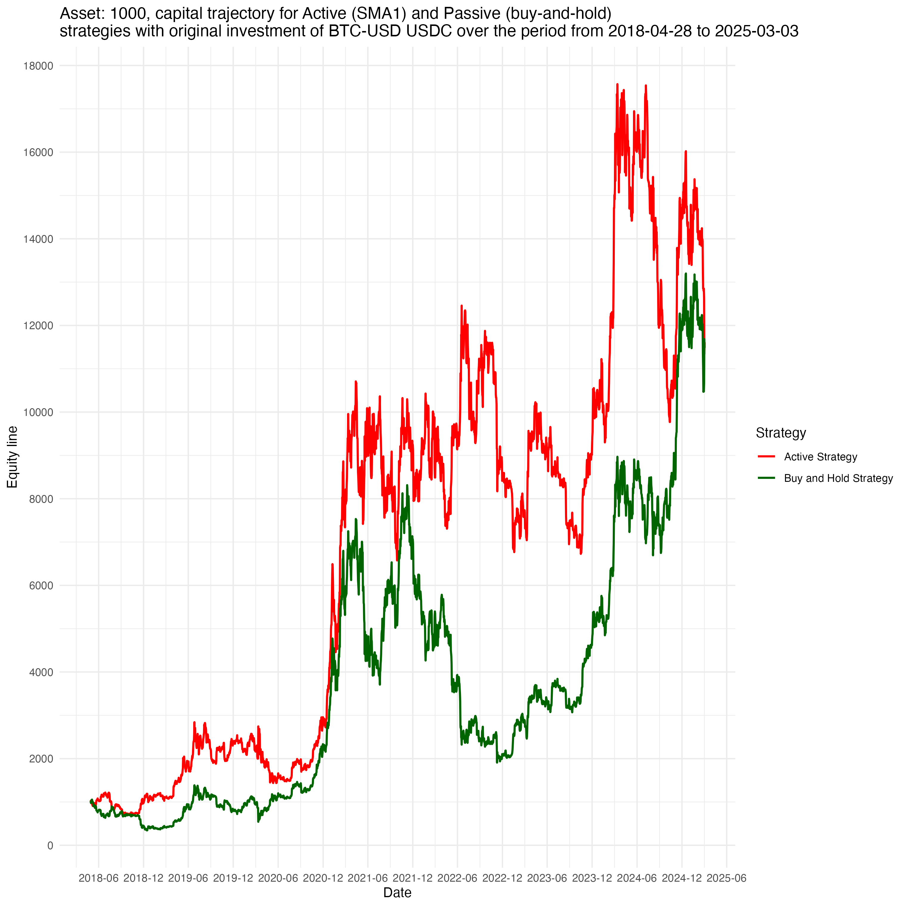

## Motivation  

Here, I test different trading ideas based on certain rules (called 'Active' strategy) and compare them with the strategy of simply buying and holding an asset ('Passive' strategy).  

The goal is to develop a superior, robust (asset-diverse, multimarket, multiperiod) price-based system. The trading profile of a strategy is estimated using different metrics to measure return and risk.  

All strategies are built using the R6 class system, which provides a modular and flexible framework for adding new strategies or features. This framework is deployed to the Shiny web server: [http://kraif999.shinyapps.io/backtesting_trading_strategies](http://kraif999.shinyapps.io/backtesting_trading_strategies).  

Choose an instrument, a strategy, a trading horizon, specify the strategy specific parameters and see how the strategy's trading profile, portfolio equity curves, and the list of all trades would look if you had consistently and strictly invested using that strategy signals with no emotions involved. 
The algorithm executes the strategy and calculates the number of positions, PnL, and equity curves based on the daily positions.
If risk management rules are applied, stop loss and take profit levels are calculated, and positions are automatically adjusted when these events occur. There is an option to either stay flat until a new signal is generated or re-enter the position after a stop-loss or take-profit event.
Additionally, other useful metrics are computed, for example, annualized volatility, average true range, and many more, see in *backtesting_trading_strategies/strategies.R).*

There is no such strategy combination that always guarantees highly superior returns under all market conditions, therefore, for a particular strategy the robustness conclusion could be based on how a strategy's trading profile looks on average given a different sets of strategy's combinations.

---

## Design  

The process is to first check a strategy on *in_sample data* (multimarket and multiperiod), then if results are promising, check it on *out_of_sample* data.

The high-level structure looks like this:  

- A parent class, **DataFetcher**, has methods to retrieve data from Yahoo (using overlapping daily data).  
- The **TSA** class analyzes data from various perspectives to understand different data characteristics and patterns.  
- A parent class for all strategies, **Strategy**, includes a generic signal generation method (overridden by specific strategies) and estimates the trading profile for both in-sample and out-of-sample data. It can also split in-sample or out-of-sample data further to evaluate the performance under different market regimes. 
- Child classes of the **Strategy** class represent different trading strategies, based on:
  - Technical Indicators (trend-following, mean-reverting, breakouts, etc.) 
  - Statistical approaches (GARCH, ARIMA)  
  - Other approaches (AlphaEngine: coastline counter-trend trading)  

Any market instrument available through a Yahoo ticker can be tested. Here, I explore several across different asset classes *FX*, *Equities*, *Commodities*, *Cryptocurrencies*, and *Fixed Income* to find potential strategy candidates for specific instruments.

The taxonomy of the trading strategies implemented is as follows:  

See below example of classes design in R.

Below is an illustration of Bitcoin's trading profile based on the *SMA strategy, in particular, Exponential Moving Average (SMA) 116-day window)*. Risk management is implemented by setting a stop loss to ensure that no more than 1/10th of the invested capital is lost at each trading day, with a reward-to-risk ratio of 3. No leverage is applied.

**The dynamics of invested capital:**  

Since the start of the investment, the active strategy's portfolio value remained higher than the passive strategy's, holding its lead until late 2024. However, the passive strategy has taken the lead since then. Notably, the active strategy has exhibited a lower maximum drawdown compared to the passive strategy.

**Strategy trading profile:**  

| Metric                          | V1 (in-sample) | V2 (in-sample) | V1 (out-sample) | V2 (out-sample) | Units |
|---------------------------------|----------------|----------------|-----------------|-----------------|-------|
| ticker                          | BTC-USD        | BTC-USD        | BTC-USD         | BTC-USD         |       |
| from                            | 2018-04-28     | 2018-04-28     | 2024-04-27      | 2024-04-27      |       |
| to                              | 2024-01-01     | 2024-01-01     | 2025-02-15      | 2025-02-15      |       |
| data_type                       | in_sample      | in_sample      | out_of_sample   | out_of_sample   |       |
| leverage                        | 1              | 1              | 1               | 1               |       |
| max_risk                        | 0.1            | 0.1            | 0.1             | 0.1             |       |
| reward_ratio                    | 3              | 3              | 3               | 3               |       |
| capital                         | 1000           | 1000           | 1000            | 1000            | USD   |
| Strategy                        | Active         | Passive        | Active          | Passive         |       |
| Gross Profit                    | 9176           | 4404           | -14             | 542             | USD   |
| Annualized Profit               | 32.56          | 22.75          | -1.22           | 44.94           | %     |
| Number of Trades Per Year       | 13             | 0              | 9               | 0               |       |
| Percentage of Winning Trades    | 52.75          | NotApplicable  | 33.33           | NotApplicable   | %     |
| Average Win                     | 98             | 65             | 19              | 23              | USD   |
| Length of Average Win           | 29             | 18             | 30              | 26              | days  |
| Largest Win                     | 1166           | 866            | 82              | 124             | USD   |
| Length of Largest Win           | 66             | 36             | 52              | 31              | days  |
| Average Loss                    | -93            | -64            | -17             | -20             | USD   |
| Length of Average Loss          | 16             | 29             | 10              | 10              | days  |
| Largest Loss                    | -924           | -887           | -112            | -96             | USD   |
| Length of Largest Loss          | 17             | 17             | 21              | 95              | days  |
| Average Winning Run             | 1.97           | 1.91           | 1.83            | 1.99            | days  |
| Length of Time in Avg Win Run   | 2              | 2              | 2               | 2               | days  |
| Largest Winning Run             | 12             | 10             | 7               | 7               | days  |
| Length of Time in Largest Win Run | 12          | 10             | 7               | 7               | days  |
| Average Losing Run              | 1              | 1              | 1               | 1               | days  |
| Length of Time in Avg Lose Run  | 2              | 2              | 2               | 2               | days  |
| Largest Losing Run              | 12             | 10             | 7               | 7               | days  |
| Length of Time in Largest Lose Run | 12         | 10             | 7               | 7               | days  |
| Max Drawdown                    | -42.05        | -77.05         | -39.81          | -24.84          | %     |
| Length of Max Drawdown          | 161            | 366            | 98              | 77              | days  |
| Start Date Max Drawdown         | 2021-04-13     | 2021-11-08     | 2024-07-07      | 2024-05-20      | Date  |
| End Date Max Drawdown           | 2021-09-21     | 2022-11-09     | 2024-10-13      | 2024-08-05      | Date  |
| Max Run-Up                      | 1342.71        | 2318.52        | 52.03           | 97.20           | %     |
| Length of Max Run-Up            | 1928           | 1059           | 100             | 134             | days  |
| Start Date Max Run-Up           | 2018-09-21     | 2018-12-15     | 2024-10-13      | 2024-08-05      | Date  |
| End Date Max Run-Up             | 2024-01-01     | 2021-11-08     | 2025-01-21      | 2024-12-17      | Date  |

While the active strategy performs better in-sample in terms of return and risk, its performance declines in the out-of-sample period. 
The framework allows users to select different assets, periods (including custom splits for further periods), strategies, parameters, risk management applications, and leverage, providing a comprehensive strategy profile view as if it had been consistently applied. For instance, once the strategy is deployed, you may not be aware of the current winning or losing streak, but knowing this could give you valuable insights into the strategy’s performance and overall dynamics.

**Backtesting results:**

Below is an illustration of backtesting results.
The engine is run for BTC-USD using different sets of SMA1 strategy combinations and risk management parameters (including leverage).
In-sample data is used in order to identify good candidates, and check their performance on the out-of-sample data.
Here SMA1 with 116 days could be considered as such.
The engine is flexible, and the same approach can be applied to any strategy and asset from the list provided above.

### Parameters used in the backtest:
- **Symbols**: BTC-USD
- **Window Sizes**: 10, 12, 16, 20, 24, 31, 38, 48, 60, 75, 93, 116, 146, 182
- **Moving Average Types**: SMA, EMA
- **Data Type**: in_sample
- **Split**: FALSE
- **Cut Date**: 2024-01-01
- **From Date**: 2018-01-01
- **To Date**: 2024-01-01
- **Slicing Years**: 4
- **Risk Management**: Applied
- **Flat After Event**: TRUE, FALSE
- **Max Risks**: 0.1, 0.2, 0.3
- **Reward Ratios**: 2, 3
- **Leverages**: 1, 2

